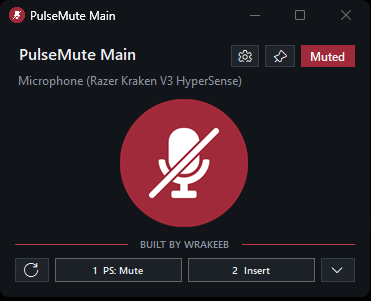
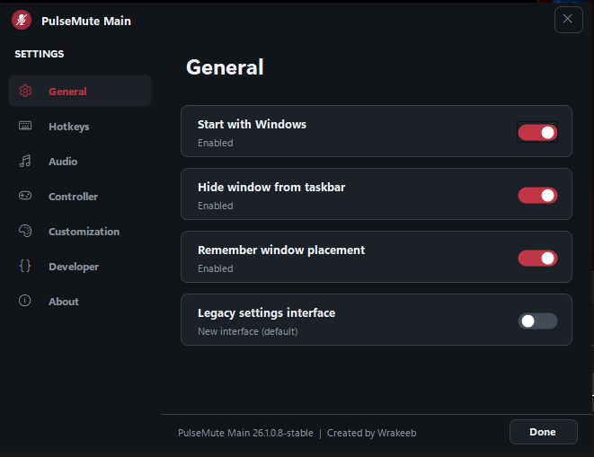
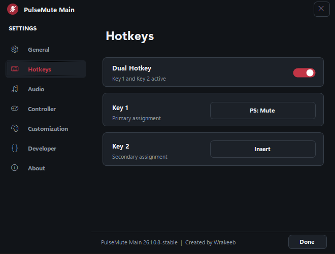
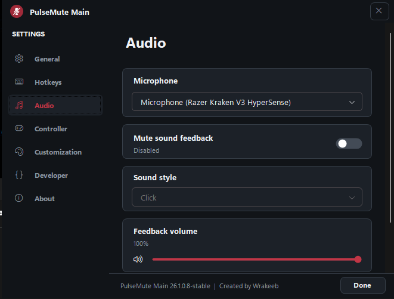
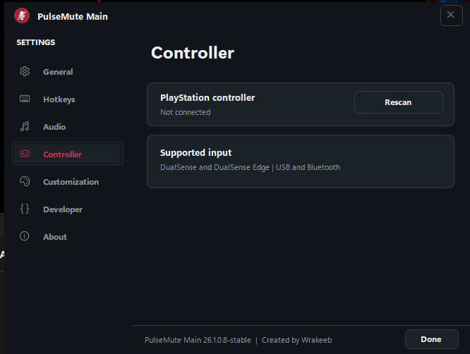
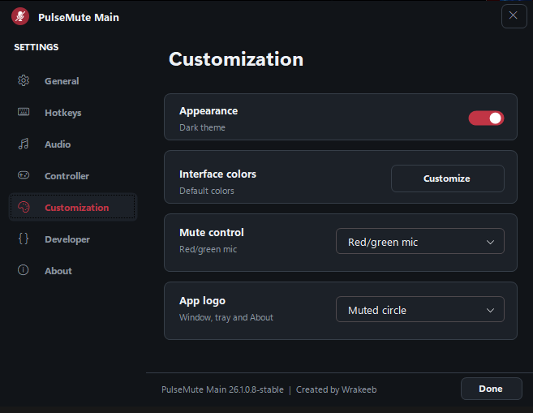
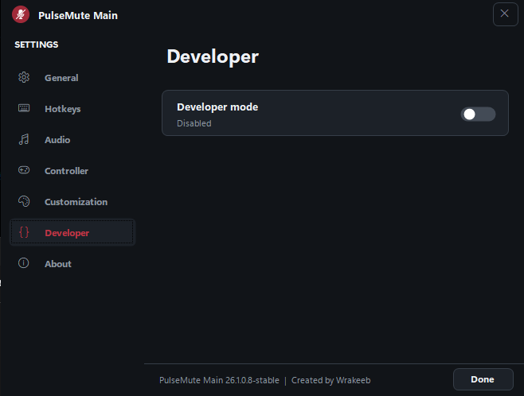
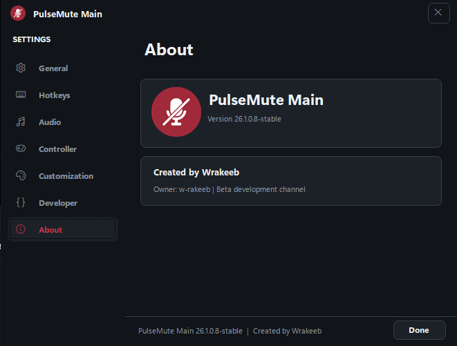

# PulseMute

PulseMute is a compact Windows microphone mute utility created by **Wrakeeb**.

Current release: `26.1.0.9-stable`

[Website](https://pulsemute-wrakeeb.vercel.app) | [Owner](https://github.com/w-rakeeb)

## Download

Download the portable Windows build from this repository:

- [`PulseMute.exe`](PulseMute.exe)

No installer is required.

## Screenshots

| Main window | General settings |
| --- | --- |
|  |  |

| Hotkeys | Audio |
| --- | --- |
|  |  |

| Controller | Customization |
| --- | --- |
|  |  |

| Developer | About |
| --- | --- |
|  |  |

## Features

- Toggle a selected Windows microphone from the app or system tray.
- Two independent keyboard, mouse, or PlayStation controller hotkeys.
- Full DualSense and DualSense Edge support over USB and Bluetooth.
- Assign the DualSense Mute, PS, touchpad, D-pad, trigger, Fn, or rear-paddle buttons.
- Mouse buttons 1-5 and vertical or horizontal wheel assignments.
- Optional Dual Hotkey mode.
- Nine mute and unmute feedback sounds with volume control.
- Resizable compact interface with stay-on-top and placement memory.
- Optional Windows startup and taskbar hiding.
- Dark and White themes with customizable interface colors.
- Selectable app logos and mute-control designs.
- New sidebar Settings interface with an optional legacy layout.
- Developer Mode with preserved-version information and launching.
- Isolated settings, startup registration, and duplicate-instance identity.

## Source

The complete editable application is in [`Source`](Source). The website source is in the repository root so the same GitHub repository can deploy to Vercel.

Important files:

- `Source/Program.cs` - main window, microphone control, hotkeys, tray, and controller logic.
- `Source/SidebarSettings.cs` - sidebar Settings interface and custom controls.
- `Source/PulseMute.csproj` - .NET project metadata, version, and assets.
- `Source/build.ps1` - repeatable Windows build script.
- `Source/test-controller.ps1` - automated protocol, UI, archive, and controller checks.
- `src` and `public` - React/Vite website source and public assets.
- `Updates` - Stable release notes.
- `Screenshots` - application screenshots used by this README.

See [`FILE_GUIDE.md`](FILE_GUIDE.md) for a beginner-friendly project map.

## Logo artwork

The original scalable vector artwork is stored in [`Logo`](Logo):

- `PulseMute Muted.svg` - red muted microphone identity and main app logo.
- `PulseMute Unmute.svg` - green live-microphone state artwork.

SVG means Scalable Vector Graphics. These master files remain sharp at any size and are used to generate the PNG and Windows ICO assets bundled with the app.

## Build

### PowerShell

```powershell
.\Source\build.ps1
```

This creates `PulseMute.exe` in the repository root.

### Visual Studio or VS Code

Open `PulseMute.sln` in Visual Studio or `PulseMute.code-workspace` in VS Code.

### Tests

```powershell
.\Source\test-controller.ps1
```

The test suite uses synthetic input reports and performs a read-only hardware check when a DualSense controller is connected.

## Website

```powershell
npm install
npm run dev
```

Production build:

```powershell
npm run build
```

## Requirements

- Windows 10 or Windows 11.
- A microphone available through Windows Core Audio.
- Optional DualSense or DualSense Edge controller.
- .NET SDK only when building through the project file; the included PowerShell build uses the Windows compiler and bundled HidSharp dependency.

## License

See [`LICENSE`](LICENSE) and [`THIRD_PARTY_NOTICES.md`](THIRD_PARTY_NOTICES.md).
